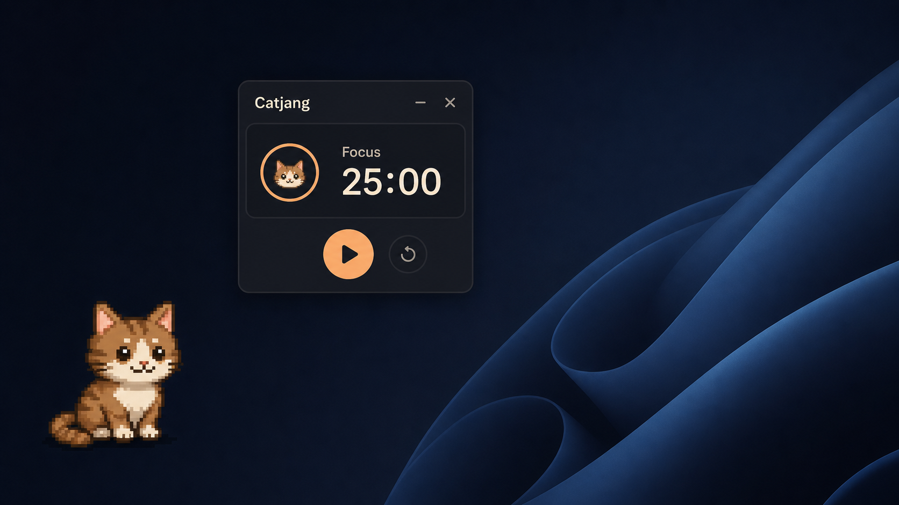

# Catjang



> **Community compatibility fork:** This repository is an experimental,
> non-commercial community adaptation of the archived
> [`cloud9209/catjang-sue`](https://github.com/cloud9209/catjang-sue)
> prototype. It is not an official Comnyang release and is not endorsed by the
> original author. See [NOTICE.md](NOTICE.md) for attribution and the change
> notice.

> **Windows work:** the active Windows compatibility branch is
> [`community/windows`](https://github.com/ModLovelace/catjang-sue/tree/community/windows).
> Its scope, validation status, Node.js policy, and release requirements are in
> [WINDOWS-COMPATIBILITY-PLAN.md](WINDOWS-COMPATIBILITY-PLAN.md).

## Community branch model

This fork uses a shared, protected base and independent platform branches:

```text
community/base
├─ community/linux-wayland
└─ community/windows
```

`community/base` preserves the common project state. Platform work belongs in
its corresponding `community/*` branch; future features are integrated into the
relevant platform branch instead of making Windows depend on Linux/Wayland or
vice versa.

`main` is retained only as a historical mirror of the original upstream state.
It has no fork-specific changes and currently matches `community/base`; shared
work belongs in `community/base` and Windows work belongs in `community/windows`.

## Releases (Windows & macOS Apple Silicon)

The latest public release is
[Catjang v0.1.39](https://github.com/ModLovelace/catjang-sue/releases/tag/v0.1.39),
featuring full multi-mascot support (Catjang, Toto, Chisi, Milo, Musubi), deliberate petting gestures,
and stable AI agent integration (Antigravity/Gemini, Claude, Cursor) for both Windows (x64) and macOS (Apple Silicon M1/M2/M3/M4 & Intel).

The current preview is
[v0.1.40-experimental.1](https://github.com/ModLovelace/catjang-sue/releases/tag/v0.1.40-experimental.1).
It adds Chuño, nap handling, updated agent reactions, and the latest desktop
performance fixes. Its macOS and Windows packages are unsigned; follow the
[experimental installation guide](docs/EXPERIMENTAL_INSTALLATION.md) to open
them and verify their SHA-256 checksums.

For development, install NVM for Windows, select Node `24.18.0` with
`nvm use 24.18.0`, then run `npm ci` and `npm start`. End users do not need
Node.js or a repository clone: they install the `.exe` from a release.

## Roadmap

- Maintain separate Windows and Linux/Wayland compatibility branches from the
  shared base.
- Investigate Apple Silicon support for M1-class Macs (macOS).
- Evaluate an iOS/iPadOS port separately; M1 iPads do not run macOS desktop
  applications directly and require their own platform adaptation.
A small companion cat that lives on your desktop while you work — pomodoro timer, reminders, AI-agent awareness, and a tiny pattern editor so you can paint the cat the way you like.

> **Note:** This is a prototype build. The license flow uses a local prototype endpoint with hardcoded keys (see [Prototype license keys](#prototype-license-keys) below) and is not connected to a real payment backend.

## Features

- **Desktop pet** that follows your cursor, reacts to typing (typing heat, purr, head shake), and stretches on a schedule.
- **Pomodoro** with focus / break timers and a quick context-menu picker.
- **Reminders** that trigger pings or speech bubbles, with one-off / weekday / weekend / custom repeat rules.
- **AI-agent awareness** — hook scripts for **Claude Code**, **Antigravity (Gemini)**, and **Cursor** so the pet notices when an agent is thinking, working, idle, or waiting for approval.
- **Pattern editor** for painting the cat's spots, base color, eye color (incl. odd-eye), and saving / exporting presets.
- **Share video** capture (mp4) of a screen crop with the pet in frame.
- **Multi-language** UI: Español, English, 한국어, 日本語.

## Stack

- [Electron](https://www.electronjs.org/) (main + renderer + separate editor + license windows)
- `uiohook-napi` for global keyboard / wheel hooks
- `ffmpeg-static` for the share video mp4 conversion
- `electron-builder` for packaged builds (configured in `package.json`)

## Quick start

```bash
git clone https://github.com/ModLovelace/catjang-sue.git catjang
cd catjang
npm ci
npm start
```

On first launch the app will show the license window. Enter one of the [prototype keys](#prototype-license-keys) below.

### Other scripts

| Script | What it does |
| --- | --- |
| `npm start` | Run the app in dev mode. |
| `npm run smoke` | Boot the app, log a startup line, and quit. Useful for CI smoke tests. |
| `npm run pack` | Build an unpacked Electron app into `dist/`. |
| `npm run dist` | Build installable artifacts for the current OS (`.dmg` / `nsis` / `AppImage`). |
| `npm run dist:win` | Windows-only `.exe` installer (NSIS). |
| `npm run dist:mac` | macOS-only `.dmg`. |
| `npm run dist:linux` | Linux-only `AppImage`. |

## Linux and Wayland

The community launcher builds on Electron's two Linux backends:

- **XWayland (default in a Wayland desktop):** full elastic dragging, global
  cursor following, click-through transparent regions, and saved position.
- **Native Wayland (optional):** compositor-owned dragging and shaped input
  regions. Wayland does not expose global window coordinates, so the final
  position cannot be persisted and cursor tracking is more limited.

Build and start the isolated AppImage:

```bash
npm ci
npm run dist:linux
./run-linux.sh
```

Test native Wayland explicitly:

```bash
CATJANG_NATIVE_WAYLAND=1 ./run-linux.sh
```

`run-linux.sh` stores configuration, cache, data, and logs below the ignored
`runtime/` directory instead of changing the normal user profile. It never
enables global input monitoring or editor/agent integrations by default.

> **Security limitation:** on the tested Ubuntu 26.04 installation, AppArmor
> blocks unprivileged user namespaces and electron-builder's AppImage launcher
> consequently starts Electron with `--no-sandbox`. That disables Chromium's
> renderer sandbox. Treat the AppImage as a local experimental build; do not
> publish it as a general-purpose binary until a sandboxed launch is verified.

On the tested Ubuntu 26.04 GNOME Wayland environment, hardware acceleration
and Vulkan are disabled for stability. Rendering therefore uses CPU/system
RAM, while the desktop compositor may still use the GPU to compose the final
window.

See [LINUX-WAYLAND.md](LINUX-WAYLAND.md) for the supported modes, limitations,
security notes, and validation matrix. A Spanish guide is available in
[PRUEBA-LINUX.md](PRUEBA-LINUX.md).

## Prototype license keys

This build ships with a prototype license endpoint (`prototype-license/endpoint.js`) that accepts any of the following keys. Paste one into the license window on first launch:

```
CATJANG-PROTO-ALPH-0001-AAAA-BBBB-CCCC
CATJANG-PROTO-BETA-0002-DDDD-EEEE-FFFF
CATJANG-PROTO-GAMM-0003-GGGG-HHHH-IIII
CATJANG-PROTO-DEMO-1234-5678-9ABC-DEF0
```

The validation logic is intentionally tiny — see `prototype-license/endpoint.js` if you want to add or change keys.

> To replace this with a real backend, swap `prototype-license/endpoint.js` for an `https` call to your service and keep the same `{ ok, license }` / `{ ok: false, reason }` return shape.

## Project layout

```
main.js                       # Electron main process (windows, IPC, agent monitors, hook install)
preload.js                    # contextBridge surface exposed to renderer / editor / license
prototype-license/
  endpoint.js                 # prototype license validation (see above)
renderer/                     # pet window (HTML / CSS / JS + auto-generated cell-mappings.js)
editor/                       # pattern editor window
license/                      # license activation window
hooks/
  install.js                  # registers / updates / removes Claude / Antigravity / Cursor hooks
  catjang-claude-hook.js
  catjang-antigravity-hook.js
  catjang-cursor-hook.js
  server-config.js            # shared HTTP post helper for the hooks
agents/                       # log-file watchers for Codex / Kiro / Cursor agent activity
presets/patterns/             # built-in pattern JSON presets
svg/                          # SVG animations for the pet (idle, press, scroll, jump, stretch, ...)
workspace/
  assets/img/presets/         # preset thumbnails
  assets/sound/               # meow / alert / purring audio
  assets/svg/                 # SVG body parts + logo
assets/                       # catjang-logo.{png,ico} for the OS window icon
```

## AI-agent hook integration

These integrations are disabled by default in the community Linux build
because enabling them writes editor configuration and reads local session
logs. To opt in deliberately, start with:

```bash
CATJANG_ENABLE_AGENT_INTEGRATIONS=1 ./run-linux.sh
```

When enabled, the main process copies the three hook scripts into the
user-data `hooks/` directory and registers them with each editor's settings
file:

| Agent | Settings file | Events |
| --- | --- | --- |
| Claude Code | `~/.claude/settings.json` | `SessionStart`, `SessionEnd`, `UserPromptSubmit`, `PreToolUse`, `PermissionRequest`, `PostToolUse`, `PostToolUseFailure`, `Stop`, `StopFailure`, `Notification`, `Elicitation` |
| Antigravity (Gemini) | `~/.gemini/config/hooks.json` | `PreInvocation`, `PostToolUse`, `PostInvocation`, `Stop` |
| Cursor | `~/.cursor/hooks.json` | `beforeShellExecution`, `beforeMCPExecution` |

In addition, the in-app log monitors tail these locations to track agent state when no hook is wired up:

- Codex: `~/.codex/sessions/YYYY/MM/DD/rollout-*.jsonl`
- Kiro: `~/Library/Application Support/Kiro/logs/`
- Cursor: `~/Library/Application Support/Cursor/logs/`

Hook scripts POST events to the local agent-state server bound to `127.0.0.1:23456`.

## Permissions & platform notes

- **macOS** — first time the pet reacts to global typing, you will be prompted for **Accessibility** (and sometimes **Input Monitoring**). Both can be granted in `System Settings → Privacy & Security`.
- **Windows** — security software can block the global hook; if typing reactions never start, look for a prompt from your AV product.
- **Linux** — global keyboard and wheel monitoring is disabled by default.
  `CATJANG_ENABLE_GLOBAL_INPUT=1 ./run-linux.sh` opts in, but the optional
  `uiohook-napi` module may require X11 development packages and does not have
  complete native Wayland support.

## License

CC BY-NC 4.0 — free to use and modify, no commercial use, credit
**jan (nerfspeed on Discord)**, link the license, and identify modifications.
See [`License.md`](./License.md) and the community change notice in
[`NOTICE.md`](./NOTICE.md).

### License and Windows signing status

The source is publicly available, but the current **CC BY-NC 4.0** license has
a non-commercial restriction. It is therefore not an OSI-approved Open Source
license and this community fork must not be described as OSI Open Source.
Changing the license of the inherited code requires permission from its
copyright holder.

The Windows installer is currently unsigned. Signing proves the publisher and
integrity of a binary; it does not change the source license. A self-signed
certificate is not trusted by Windows and does not avoid SmartScreen warnings.
If the complete project is later relicensed by the rights holder under an
OSI-approved license, the project may apply to SignPath Foundation's free OSS
signing program, subject to its eligibility and release-policy requirements.
The selected distribution path is a **free, unsigned GitHub Release**. Each
release must state that it is unsigned, warn that Windows may show SmartScreen,
and publish the source commit plus the SHA-256 of the installer. Users do not
need Node.js or a repository clone to install the `.exe`, but they should only
download it from the project's official GitHub Release page.
